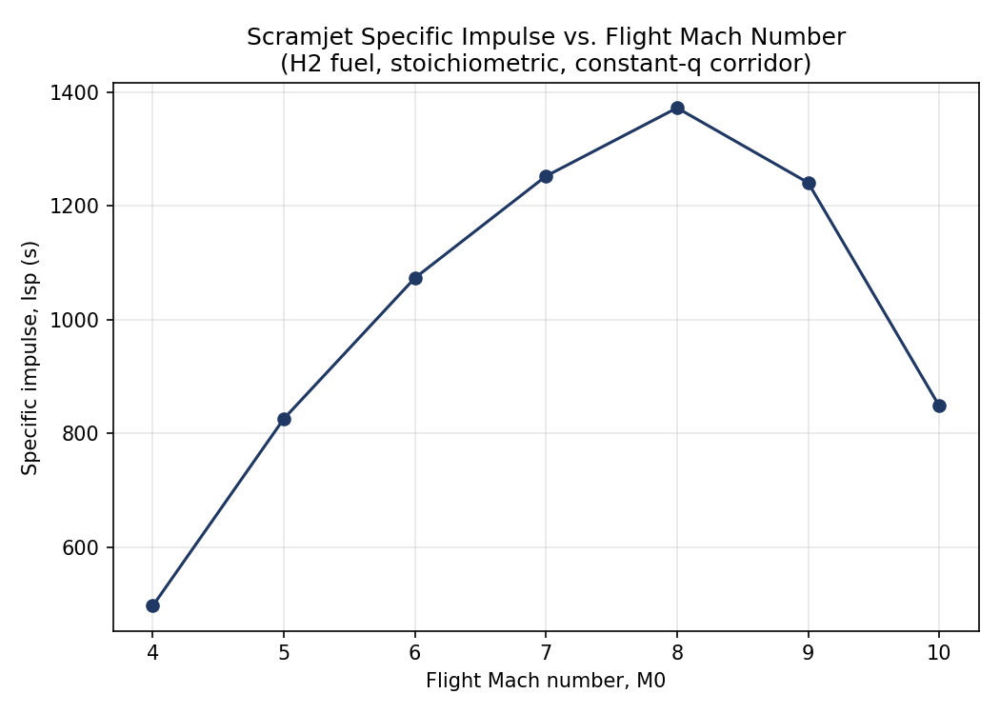

# Scramjet Engine — 1-D Cycle Performance Model

A 1-D thermodynamic and gas-dynamic performance model of a scramjet engine:
**inlet compression → combustion → nozzle expansion**, computing exit
velocity, thrust, specific impulse and overall cycle efficiency for a given
flight Mach number and altitude, using isentropic and Rayleigh-flow
relations, with an automatic thermal-choking (heat-addition-limit) check.



## Flow path modelled

```
Freestream (0) → Inlet → Station 3 (combustor entry)
              → Combustor (Rayleigh flow, heat addition) → Station 4
              → Nozzle (isentropic expansion) → Station 10 (exit)
```

## Repository layout

```
scramjet-cycle-model/
├── atmosphere.py         # ISA 1976 standard atmosphere (0-47 km)
├── gas_dynamics.py       # Isentropic + Rayleigh-flow relations, Mach-number solvers
├── scramjet_cycle.py     # Engine model: inlet, combustor, nozzle, performance
├── main.py                # CLI entry point for a single design point
├── parametric_study.py    # Mach sweep -> CSV + plots + validation checks
├── results/                # Sample CSV + plots from a Mach 4-10 sweep
├── docs/                   # Full mathematical-model reference (equations, derivations)
├── requirements.txt
└── LICENSE
```

## Installation

```bash
git clone https://github.com/<your-username>/scramjet-cycle-model.git
cd scramjet-cycle-model
pip install -r requirements.txt
```

## Usage

**Single design point:**
```bash
python3 main.py --M0 8 --altitude_km 30 --phi 1.0 --fuel H2
```
```
========================================================================
 SCRAMJET CYCLE PERFORMANCE — M0 = 8.0, altitude = 30.0 km
========================================================================
 Freestream:  T_inf=  226.65 K   p_inf=   1171.9 Pa   V0=  2414.4 m/s
 Station 3 (combustor entry):  PR=0.1590   M3=5.843   T3=  399.50 K
 Station 4 (combustor exit):   M4=1.000   T4=4838.08 K  *** THERMAL CHOKING LIMIT REACHED ***
 Station 10 (nozzle exit):     V10=2726.3 m/s
------------------------------------------------------------------------
 Specific impulse (fuel): 1371.0  s
 Propulsive efficiency  :   93.93 %
 Thermal efficiency     :   26.06 %
========================================================================
```

**Mach sweep with plots and validation:**
```bash
python3 parametric_study.py
```
Writes `results/scramjet_parametric_results.csv` and four performance
plots (Isp, thrust, station temperatures, efficiencies vs. Mach number),
and prints benchmark/sanity checks against literature-reported ranges.

## Modelling approach

This is a **cycle-analysis-level** model — the right fidelity for
performance trends and sizing numbers quickly, distinct from CFD or
finite-rate chemistry. Key assumptions:

1. Calorically perfect gas throughout (γ = 1.4, constant cp).
2. Inlet losses lumped into the MIL-E-5008B empirical stagnation-pressure-
   recovery correlation; Mach-number drop from the isentropic area-Mach
   relation for a specified contraction ratio.
3. Combustor: constant-area, frictionless Rayleigh flow; heat addition
   from fuel equivalence ratio and combustion efficiency, automatically
   capped at the thermal-choking limit (M → 1).
4. Nozzle: isentropic expansion to ambient (perfectly-expanded) static
   pressure, corrected by a nozzle thermodynamic efficiency.
5. No isolator shock-train or viscous-drag model (derivations for these
   extensions are in `docs/Scramjet_Engine_Mathematical_Model.docx`).

## Validation

- Every inverse solver in `gas_dynamics.py` round-trips exactly against
  the forward relation it inverts.
- `atmosphere.py` reproduces standard ISA table values at the reference
  altitudes (11, 20, 32 km, ...).
- Inlet pressure recovery follows the MIL-E-5008B correlation shape
  (monotonically decreasing with Mach number, bounded in (0, 1]).
- Predicted specific impulse for stoichiometric H2 falls inside the
  literature-reported range (~800–3500 s, M0 = 5–10; e.g. Heiser & Pratt,
  *Hypersonic Airbreathing Propulsion*), and the Isp–Mach curve reproduces
  the expected shape (peak near M0 ≈ 7–8, falling off as the flow
  approaches thermal choking).

## Reference

Full derivations of every equation used here (governing equations, shock
relations, inlet/isolator/combustor/nozzle models, cycle-performance
equations) are compiled in
[`docs/Scramjet_Engine_Mathematical_Model.docx`](docs/Scramjet_Engine_Mathematical_Model.docx),
based on C. Segal, *The Scramjet Engine: Processes and Characteristics*,
Cambridge University Press.

## License

MIT — see [LICENSE](LICENSE).
